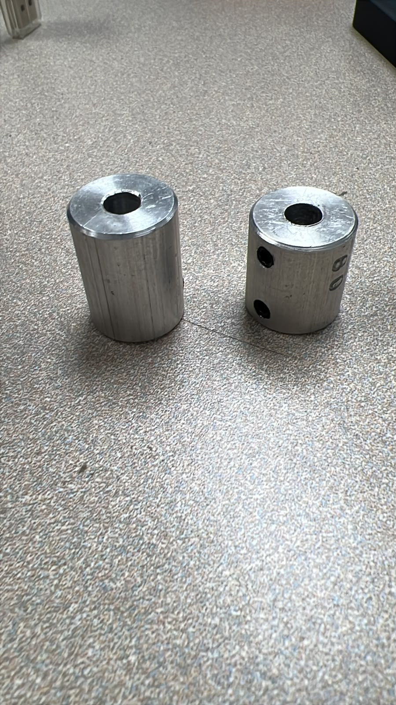
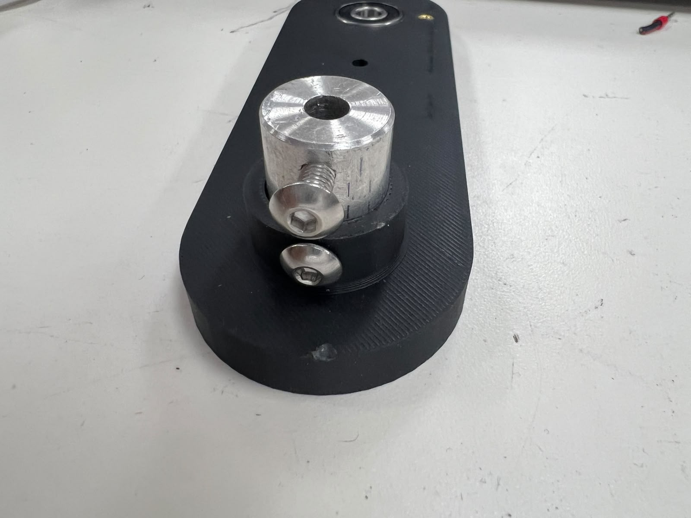
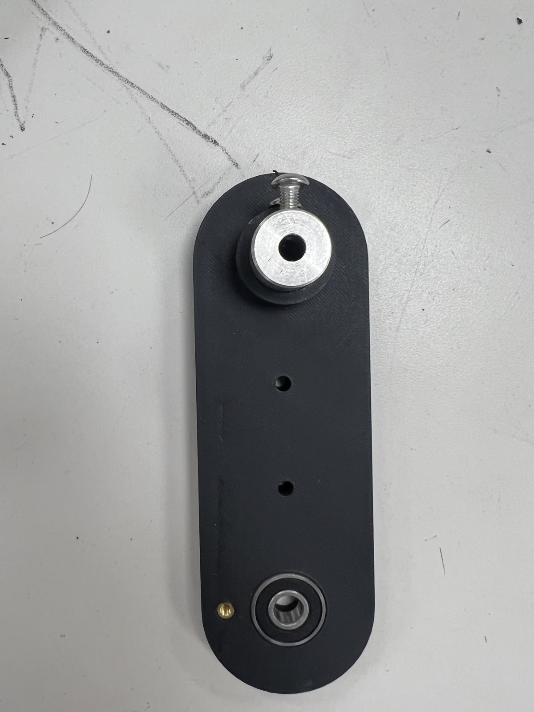

# Parts to print (team redesign)

This project uses the **team redesign** (see `HOPPY_BoM.xlsx`), not the original
goBilda parts from the upstream kit. The parts to print are **IMP-1 ... IMP-30
plus CASE 1/2**.

> An earlier version of this folder held STLs of the original goBilda parts. They
> were removed because the redesign starts from our own geometry, fabricated by
> 3D printing and PVC tubes.

## What is here

- **Print-ready STLs:** the [`STL/`](STL/) folder holds the **33 parts from the
  BOM**, split by material: [`STL/PLA/`](STL/PLA/) (29 parts) and
  [`STL/ABS/`](STL/ABS/) (4 parts: IMP-16, IMP-17, IMP-20, IMP-30). They are
  ready to slice. `IMP-3` and `IMP-6` (the whole-piece versions) and `IMP-23`
  (outside the BOM) are not included.
- **Start with the long parts** (more than 15 h each): IMP-3A, IMP-3B, IMP-6A,
  IMP-6B, IMP-27, IMP-28.

## Motor-shaft coupling: IMP-8 and IMP-10 (two options)

IMP-8 and IMP-10 are the printed parts that transmit motor torque to the leg:
they grip the motor output shaft. With the original parts the coupling stripped
and rounded out under the repeated hop loads, so the motor shaft spun without
driving the leg and the robot could not deliver the full push-off force.

There are two versions of each part. Pick one:

- **Original** (`IMP-8.STL`, `IMP-10.STL`): print and use as-is, no extra hardware.
- **Set-screw version** (`IMP-8_setscrew.STL`, `IMP-10_setscrew.STL`): instead of
  relying on the printed bore, these seat an aluminum hub clamped to the shaft
  with set screws (grub screws), which bite onto the shaft and hold the torque
  through the hop. Use this version **only if you have that aluminum set-screw
  coupler** (the part on the right in the photo below). This is the version that
  fixed the stripping on our robot.

## Print summary (from the BOM)

- **Total:** 33 parts, **49 copies**, about **4.27 kg** of filament and **240 h**
  of printing.
- Most parts are **PLA**. In **ABS**: IMP-16, IMP-17, IMP-20, IMP-30.
- Long parts (spread them across printers): IMP-3A/3B and IMP-6A/6B (about 22 h
  each), IMP-27 (about 18 h), IMP-28 (about 15.5 h).
- **IMP-8 and IMP-10 come in two versions** (original and set-screw, see the
  section above). You do not print both: choose **one version of each part**, the
  original, or the set-screw one if you have the aluminum coupler. The totals
  above count one version per part.

## PLA print recommendations

The robot takes impacts on landing, so for PLA:

- Nozzle **210-220 C**, slow perimeters (**30-40 mm/s**), fan **40-70 %**.
- **5 walls**, infill **50-70 %**, 6 top/bottom layers.
- **Print lying down** so the impact runs along the layers and does not
  delaminate.
- M2/M3/M4 heat-set inserts: heat with a soldering iron and press in; do not
  print threads.
- Start tests with a low hop force, and keep spares of the leg parts.
