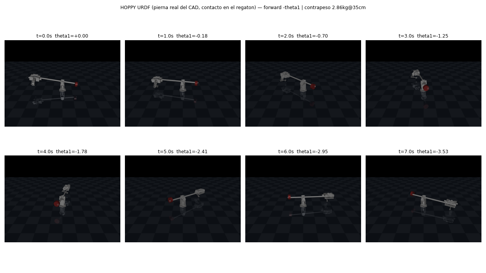

# HOPPY: robot saltarin de una pierna

Simulacion en MuJoCo e implementacion fisica de HOPPY, un robot saltarin de una
pierna montado en un boom giratorio. El proyecto parte del kit educativo
[HOPPY de la Universidad de Illinois](https://github.com/RoboDesignLab/HOPPY-Project)
(Ramos et al., [arXiv:2010.14580](https://arxiv.org/abs/2010.14580)) con un
rediseno mecanico propio: pierna tipo ave con rodilla de cuatro barras, piezas
impresas en 3D y tubos de PVC.



El resultado final en hardware: el robot salta de forma autonoma y continua
(64 saltos registrados por su propia telemetria, 0.27 s de vuelo por salto,
unos 9 cm de apex), igualando el desempeno de su simulacion (0.25 s de vuelo).

## Contenido del repositorio

| Carpeta | Contenido |
|---|---|
| `mujoco/` | Simulacion completa en MuJoCo: tres modelos, controlador hibrido, suite de verificacion y analisis |
| `Microcontroller/` | Firmware C2000 (LaunchPad F28379D) del robot fisico: control en tiempo real a 1 kHz |
| `CAD/` | Ensamble del rediseno (SolidWorks/STEP), parametros nominales y piezas a imprimir |
| `Simulator_MATLAB/` | Simulador MATLAB original del paper, usado como referencia de validacion |

## Simulacion (mujoco/)

Requisitos: Python 3 con `mujoco`, `numpy` y `matplotlib`.

### Los tres modelos

El proyecto evoluciono en tres modelos, cada uno con un proposito:

| Modelo | Archivo | Geometria | Salto | Proposito |
|---|---|---|---|---|
| Abstracto | `tune_eval.py` | simplificada (anclada a `get_params.m`) | 7.2 cm | validacion contra el MATLAB del paper |
| Gemelo CAD | `twin.py` | dimensiones, masas e inercias medidas del CAD | 8.8 cm | fidelidad estructural al rediseno |
| URDF real | `hoppy_urdf.py` | exportado de SolidWorks (sw2urdf) | 7.6 cm de vuelo, avanza | el modelo que corre el control del robot |

Los tres comparten el mismo controlador (`controller.py`), un port fiel del
simulador MATLAB del paper: maquina de estados FLIGHT/STANCE a 1 kHz, control
cartesiano del pie por Jacobiano transpuesto en vuelo, perfil Bezier de fuerzas
de reaccion en apoyo, modelo de actuador por voltaje con back-EMF y saturacion,
y velocidad estimada por derivada filtrada (emulacion de encoder).

### Como correr

| Que | Comando |
|---|---|
| Ver el URDF real saltando | `python3 view_hop_urdf.py --viewer` |
| Ver el gemelo CAD saltando | `python3 view_twin.py` |
| Verificacion del abstracto vs MATLAB | `python3 verify.py` |
| Verificacion del gemelo | `python3 -c "import twin; from verify import verify; verify(dict(twin.DEFAULTS), mdl=twin)"` |
| Chequeo por componentes del gemelo | `python3 twin_check.py` |
| Senales de todas las fases | `python3 plot_signals.py` |
| Ablacion del modelo mecanico | `python3 ablacion.py` |
| Comparacion de integradores | `python3 comparacion_integradores.py` |
| Renders y videos (sin pantalla) | `MUJOCO_GL=egl python3 render_twin.py` |

`verify.py` es deliberadamente exigente: pide empuje real (la fuerza de contacto
carga de verdad), fase de vuelo, ausencia de aleteo y ciclo limite estable.
Una metrica que solo cuenta despegues del pie acepta soluciones degeneradas
(la pierna aleteando sin saltar); esta suite no.

## Parametros fisicos y su justificacion

### Geometria de la pierna (medida del CAD y del documento de parametros nominales)

| Constante | Valor | Que es |
|---|---|---|
| `LH` | 0.096 m | longitud del muslo (eje de cadera a eje de rodilla) |
| `LK` | 0.1545 m | longitud de la pantorrilla (tubo) |
| `DK` | 0.052 m | offset lateral del tubo respecto al eje de la rodilla |
| `LKF` | 0.1635 m | pantorrilla efectiva, `sqrt(LK^2 + DK^2)` |
| `LB`, `DB`, `HB` | 0.687, 0.187, 0.250 m | boom: pivote a cadera, offset lateral, altura del pivote |

La pierna del rediseno es tipo ave (espejo del HOPPY original): la rodilla
apunta hacia atras y flexionarla manda el pie hacia adelante. El tubo nunca se
alinea con el muslo; en el tope de extension ya forma unos 134 grados con el.

### Actuadores (datasheet goBILDA 5202, serie Yellow Jacket)

| Constante | Valor | Justificacion |
|---|---|---|
| `NH` | 26.9 | reduccion del motor de cadera |
| `NK` | 28.8 | reduccion efectiva de la rodilla (la escala del encoder convierte el 26.9 fisico en 28.8 efectivo, que coincide con el documento nominal del kit) |
| `Rw` | 1.3 ohm | resistencia de armadura |
| `kT` | 0.0135 N m/A | constante de torque |
| `kv` | 0.0186 V s/rad | constante de back-EMF |
| `VMAX`, `IMAX` | 12 V, 9.2 A | limites electricos reales; definen el torque maximo kT por N por IMAX (3.3 a 3.6 N m por junta) |

De estos se derivan dos efectos que la simulacion modela explicitamente:

- **Inercia reflejada del rotor** (`armature = N^2 * Ir`, con `Ir = 7e-6 kg m^2`).
  Sin ella las aceleraciones son irreales: la ablacion muestra que el robot
  "salta" 67 por ciento mas alto sin armature.
- **Amortiguamiento equivalente del actuador** (`damping = kT^2 * N^2 / Rw`).
  Es la disipacion electrica del motor reflejada a la junta; no es un numero
  ajustado a mano sino derivado del modelo electrico.

La saturacion NO es un clip de torque: el controlador convierte torque deseado a
voltaje (`V = Rw/(kT N) tau + kv N qdot`), recorta a 12 V, calcula la corriente
contra el back-EMF, la recorta a 9.2 A y recien ahi obtiene el torque aplicado.
Asi el limite depende de la velocidad, como en el motor real.

### Resorte de rodilla

El robot real lleva dos resortes de tension (Ks = 1.67 kN/m, L0 = 80 mm) en un
arreglo serie-elastico a traves del cuatro barras. En el modelo se representa
como resorte de junta (`stiffness` + `springref` en la rodilla). El resorte
serie-elastico fiel deja la rodilla casi rigida con este controlador (el paper
usa un control disenado para explotarlo); el trade-off esta documentado y la
ablacion cuantifica el efecto del resorte usado.

### Contacto pie-suelo

| Parametro | Valor | Justificacion |
|---|---|---|
| `solref` | 0.0191 1 | contacto duro sin rebote numerico |
| `solimp` | 0.95 0.99 0.001 | penetracion submilimetrica |
| `friction` | 2.0 | el pie real es un regaton de goma; no debe patinar durante el empuje |
| integrador | `implicitfast`, paso 1 ms | integra implicito los terminos dependientes de velocidad (damping y armature, exactamente lo que este modelo agrega); `comparacion_integradores.py` muestra que RK4 con la configuracion recomendada da el mismo salto, 15 por ciento mas lento |

La deteccion de touchdown y liftoff usa la fuerza normal de contacto contra un
umbral. Es el mismo criterio del robot fisico, cuyo sensor de pie (SoftPot) se
calibro en banco: 0 en el aire, alrededor de 200 rozando, 2870 cargado en
reposo y 4095 a plena carga, con el umbral en 2048.

### Controlador (constantes del simulador MATLAB del paper)

| Constante | Valor | Rol |
|---|---|---|
| `Kp_sw`, `Kd_sw` | 150, 5 | PD cartesiano del pie en vuelo (N/m, N s/m) |
| `Krh` | 0.10 | colocacion de pie tipo Raibert |
| `Tst` | 0.35 s | duracion nominal del apoyo |
| `Fz_bz` | [0, 20, 100, 0, 0] | puntos de control Bezier de la fuerza vertical (pico real ~42 N) |
| `Fx_bz` | [0, 0, -25, 0, 0] | empuje tangencial; su signo fija el sentido de avance |
| `Kp_st`, `Kd_st` | 0.03, 0.08 | PD suave de junta en apoyo (regularizador) |
| blending | 10 ms | mezcla aereo-apoyo para no meter escalones de torque |
| `lambda` | 10 rad/s | filtro de la velocidad estimada (emulacion de encoder) |

## Firmware (Microcontroller/)

Firmware para la LaunchPad F28379D (C2000) sobre el ejemplo del kit original,
con el mismo controlador del paper corriendo a 1 kHz. Toolchain: Code Composer
Studio 12.8, compilador C2000 22.6, SYS/BIOS. El archivo activo es
`blinky_rtos_flash/cpu01/cpu01_main.c`.

Puntos clave de la implementacion:

- **Cinematica tipo ave**: IK de rama espejo y mapa polinomial del cuatro
  barras de la rodilla, `q_rodilla = KA e^2 + KB e + KC` con `KA = -0.454`,
  `KB = -1.534`, `KC = 0.80`, calibrado en banco con plomada y fotos (la
  relacion efectiva del mecanismo varia de 1.5 en extension a 0.7 en flexion;
  el signo negativo refleja la morfologia espejo). El torque de rodilla se
  mapea por trabajo virtual con la derivada del mismo polinomio.
- **Modelo electrico del motor en el lazo** (la misma ecuacion de la sim):
  torque deseado a voltaje con compensacion de back-EMF, a PWM con el bus de
  12 V como escala.
- **Maquina de estados de salto continuo** (`JUMP_MODE`): touchdown por flanco
  del sensor de pie con anti-rebote, empuje Bezier de apoyo, liftoff temprano
  cuando el sensor se descarga, recuperacion aerea a la pose de aterrizaje.
- **Telemetria a bordo**, legible en vivo por CCS Expressions: contador de
  saltos, duracion del ultimo vuelo (la altura del apex es g t^2/8), duracion
  real del ultimo apoyo y picos de PWM y recorrido de rodilla por empuje.
- Seguridad: bandera de motores, limite de PWM ajustable en vivo y arranque
  con valores inertes.

El robot se balancea con un contrapeso en el boom (5 kg a 19 cm en el montaje
actual, ajustado con el metodo del punto de flotacion: se busca la distancia
que deja el boom neutro y se monta el peso a un 76 por ciento de ella, porque
el balance total deja la pierna sin peso que la cargue).

## Validacion y resultados

- **Contra el MATLAB del paper**: la suite `verify.py` pasa 12 de 12 chequeos
  reproduciendo el comportamiento del simulador original.
- **Ablacion** (`mujoco/figuras/ablacion.png`): cuantifica el efecto de
  armature, damping, resorte y saturacion sobre el salto; sin saturacion el
  actuador ideal pide 13.2 A contra los 9.2 A fisicos.
- **En hardware**: salto autonomo continuo en sitio, 64 saltos registrados,
  0.27 s de vuelo por salto, motores trabajando dentro de sus limites.

## Limitaciones conocidas

- El avance alrededor del poste con el empuje tangencial esta limitado por la
  rigidez del poste del gantry (se mueve con la fuerza lateral sostenida); es
  un tema estructural, no de control.
- El resorte serie-elastico fiel requiere un controlador disenado para el (como
  el del paper original); con este control se usa el resorte de junta suave.
- El sensor de pie entrega posicion del punto de presion, no fuerza; el umbral
  de contacto se calibro empiricamente.

## Simulador MATLAB en Linux

El simulador de referencia corre en MATLAB R2026a:

```bash
cd Simulator_MATLAB
matlab        # dentro de la interfaz, ejecutar: MAIN
```

## Referencias

- J. Ramos, Y. Ding, Y. Sim, K. Murphy, D. Block. "HOPPY: An open-source kit
  for education with dynamic legged robots". arXiv:2010.14580.
- Kit y codigo original: [RoboDesignLab/HOPPY-Project](https://github.com/RoboDesignLab/HOPPY-Project).
- MuJoCo y la documentacion oficial de MJCF.

## Equipo

Hector Eduardo Tovar Mendoza, Jocelyn Anahid Velarde Barron, Paola Llamas
Hernandez, Jose Luis Dominguez Morales, Pablo Armando Mac Beath Milian.

Implementacion Robotica, junio 2026.
