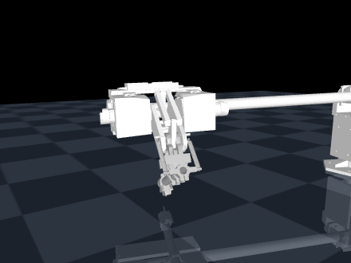
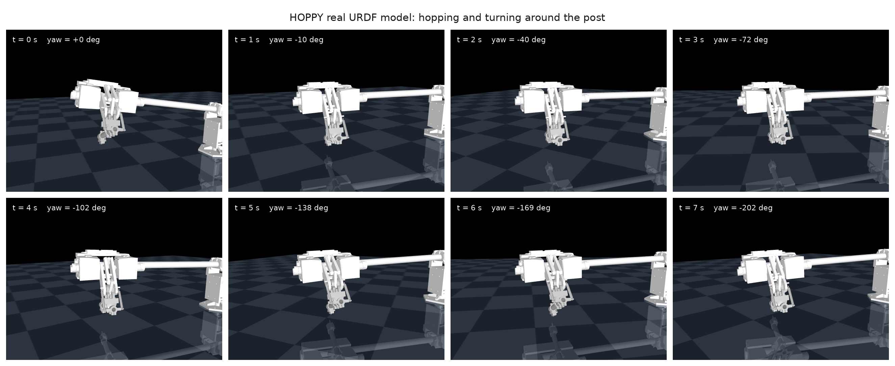
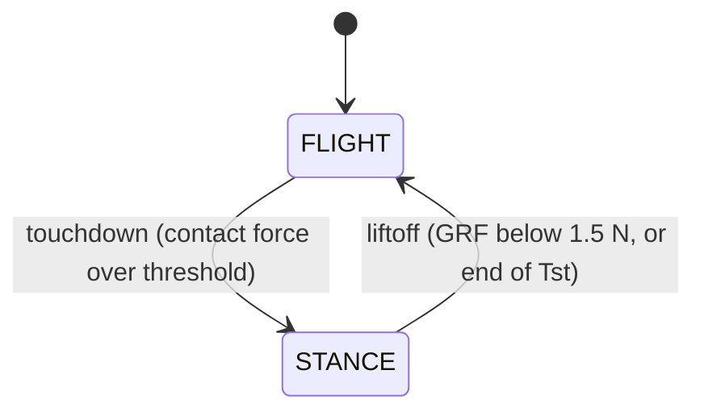
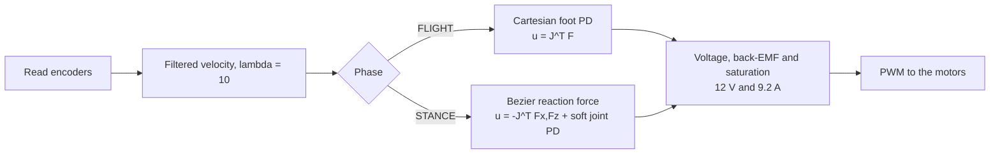
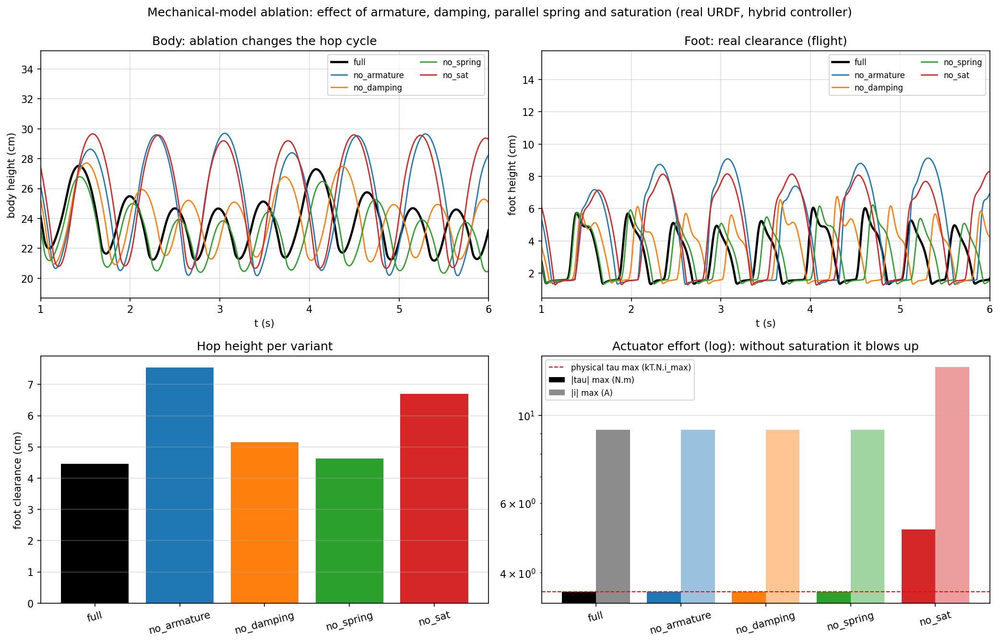

# HOPPY: a one-legged hopping robot


[](https://arxiv.org/abs/2010.14580)

MuJoCo simulation and physical implementation of HOPPY, a one-legged robot that
hops around a rotating boom. The project starts from the
[HOPPY educational kit from the University of Illinois](https://github.com/RoboDesignLab/HOPPY-Project)
(Ramos et al., [arXiv:2010.14580](https://arxiv.org/abs/2010.14580)) and adds a
mechanical redesign of our own: a bird-type leg with a four-bar knee, 3D-printed
parts and PVC tubes.



On hardware the robot hops on its own, continuously: 64 hops logged by its own
telemetry, 0.27 s of flight per hop and roughly 9 cm of apex. That flight time
is close to the simulation (about 0.33 s per hop).

The same controller in simulation, frame by frame, advancing around the post:



## Contents

- [Repository layout](#repository-layout)
- [Simulation (mujoco/)](#simulation-mujoco)
- [Physical parameters and where they come from](#physical-parameters-and-where-they-come-from)
- [Firmware (Microcontroller/)](#firmware-microcontroller)
- [Validation and results](#validation-and-results)
- [Known limitations](#known-limitations)
- [MATLAB simulator on Linux](#matlab-simulator-on-linux)
- [References](#references)
- [Authors](#authors)

## Repository layout

| Folder | Contents |
|---|---|
| [`mujoco/`](mujoco/README.md) | Full MuJoCo simulation: three models, the hybrid controller, a verification suite and the analysis scripts |
| [`Microcontroller/`](Microcontroller/README.md) | C2000 firmware (LaunchPad F28379D) for the physical robot: real-time control at 1 kHz |
| [`CAD/`](CAD/STL_imprimir/README.md) | Redesign assembly (SolidWorks/STEP), nominal parameters and the parts to print |
| [`Simulator_MATLAB/`](Simulator_MATLAB/README.md) | Original MATLAB simulator from the paper, used as the validation reference |

## Simulation (mujoco/)

Requirements: Python 3 with `mujoco`, `numpy` and `matplotlib`.

### The three models

The project grew through three models, each with its own purpose.

| Model | File | Geometry | Hop (steady regime) | Purpose |
|---|---|---|---|---|
| Abstract | `tune_eval.py` | simplified (anchored to `get_params.m`) | body rises 7.2 cm | validation against the paper's MATLAB |
| CAD twin | `twin.py` | dimensions, masses and inertias measured from the CAD | body rises 5.6 cm | structural fidelity to the redesign |
| Real URDF | `hoppy_urdf.py` | exported from SolidWorks (sw2urdf) | foot clears 4.5 cm, turns around the post | the model that runs the robot's controller |

The three share the same controller (`controller.py`), a faithful port of the
paper's MATLAB simulator: a FLIGHT/STANCE state machine at 1 kHz, Cartesian foot
control through the transposed Jacobian in flight, a Bezier reaction-force
profile in stance, a voltage-based actuator model with back-EMF and saturation,
and a velocity estimate from a filtered derivative (encoder emulation).

### Control architecture

The controller is a hybrid state machine. Touchdown and lift-off are detected
from the contact force.



Every control step runs at 1 kHz, the same loop in simulation and on the
firmware:



### How to run

| What | Command |
|---|---|
| Watch the real URDF hopping | `python3 view_hop_urdf.py --viewer` |
| Watch the CAD twin hopping | `python3 view_twin.py` |
| Verify the abstract model against MATLAB | `python3 verify.py` |
| Verify the twin | `python3 -c "import twin; from verify import verify; verify(dict(twin.DEFAULTS), mdl=twin)"` |
| Component check of the twin | `python3 twin_check.py` |
| Signals from every phase | `python3 plot_signals.py` |
| Mechanical-model ablation | `python3 ablation.py` |
| Integrator comparison | `python3 integrators.py` |
| Renders and videos (headless) | `MUJOCO_GL=egl python3 render_twin.py` |

`verify.py` is strict on purpose. It asks for real push-off (the contact force
actually loads), a flight phase, no foot flutter and a stable limit cycle. A
metric that only counts foot lift-offs accepts degenerate solutions, such as a
leg that flutters without hopping. This suite does not.

## Physical parameters and where they come from

### Leg geometry (measured from the CAD and the nominal-parameters document)

| Constant | Value | What it is |
|---|---|---|
| `LH` | 0.096 m | thigh length (hip axis to knee axis) |
| `LK` | 0.1545 m | shank length (tube) |
| `DK` | 0.052 m | lateral offset of the tube from the knee axis |
| `LKF` | 0.1635 m | effective shank, `sqrt(LK^2 + DK^2)` |
| `LB`, `DB`, `HB` | 0.687, 0.187, 0.250 m | boom: pivot-to-hip, lateral offset, pivot height |

The redesigned leg is bird-type (mirrored from the original HOPPY): the knee
points backward, and bending it drives the foot forward. The tube never lines up
with the thigh; at full extension it already sits at about 134 degrees to it.

### Actuators (goBILDA 5202 datasheet, Yellow Jacket series)

| Constant | Value | Reason |
|---|---|---|
| `NH` | 26.9 | hip motor reduction |
| `NK` | 28.8 | effective knee reduction (the encoder scale turns the physical 26.9 into an effective 28.8, which matches the kit's nominal document) |
| `Rw` | 1.3 ohm | armature resistance |
| `kT` | 0.0135 N m/A | torque constant |
| `kv` | 0.0186 V s/rad | back-EMF constant |
| `VMAX`, `IMAX` | 12 V, 9.2 A | real electrical limits; they set the maximum torque kT * N * IMAX (3.3 to 3.6 N m per joint) |

Two effects follow from these constants, and the simulation models both
explicitly.

- **Reflected rotor inertia** (`armature = N^2 * Ir`, with `Ir = 7e-6 kg m^2`).
  Without it the accelerations are unrealistic: the ablation shows the robot
  "hops" 67 percent higher when armature is removed.
- **Equivalent actuator damping** (`damping = 0.5 * kT^2 * N^2 / Rw`). This is
  the motor's electrical dissipation reflected to the joint. The 0.5 keeps it
  from double-counting the dissipation the voltage model already adds. It is not
  a hand-tuned number; it comes from the electrical model.

Saturation is not a torque clip. The controller turns desired torque into
voltage (`V = Rw/(kT N) tau + kv N qdot`), clips that to 12 V, computes the
current against the back-EMF, clips it to 9.2 A, and only then gets the applied
torque. The limit therefore depends on speed, the same way it does in the real
motor.

### Knee spring

The real robot carries two tension springs (Ks = 1.67 kN/m, L0 = 80 mm) in a
series-elastic arrangement through the four-bar. In the model this is a joint
spring (`stiffness` plus `springref` at the knee). A faithful series-elastic
spring leaves the knee almost rigid under this controller (the paper uses a
controller designed to exploit it). The trade-off is documented, and the
ablation measures the effect of the joint spring that is used.

### Foot-ground contact

| Parameter | Value | Reason |
|---|---|---|
| `solref` | 0.0191 1 | hard contact, no numerical bounce |
| `solimp` | 0.95 0.99 0.001 | sub-millimeter penetration |
| `friction` | 2.0 | the real foot is a rubber tip and must not slip during push-off |
| integrator | `implicitfast`, 1 ms step | integrates the velocity-dependent terms implicitly (damping and armature, exactly what this model adds); `integrators.py` shows that RK4 with the recommended settings produces the same hop |

Touchdown and lift-off are detected from the normal contact force against a
threshold. This is the same criterion the physical robot uses, where the foot
sensor (a SoftPot) was calibrated on the bench: 0 in the air, around 200 when
grazing, 2870 loaded at rest and 4095 at full load, with the threshold at 2048.

### Controller (constants from the paper's MATLAB simulator)

| Constant | Value | Role |
|---|---|---|
| `Kp_sw`, `Kd_sw` | 150, 5 | Cartesian foot PD in flight (N/m, N s/m) |
| `Krh` | 0.10 | Raibert-style foot placement |
| `Tst` | 0.35 s | nominal stance duration |
| `Fz_bz` | [0, 20, 100, 0, 0] | Bezier control points for the vertical force (desired peak 42.8 N) |
| `Fx_bz` | [0, 0, -25, 0, 0] | tangential push; its sign sets the direction of travel |
| `Kp_st`, `Kd_st` | 0.03, 0.08 | soft joint PD in stance (regularizer) |
| blending | 10 ms | flight-to-stance blend so no torque steps appear |
| `lambda` | 10 rad/s | filter for the estimated velocity (encoder emulation) |

## Firmware (Microcontroller/)

Firmware for the LaunchPad F28379D (C2000), built on the original kit example,
running the same controller from the paper at 1 kHz. Toolchain: Code Composer
Studio 12.8, C2000 compiler 22.6, SYS/BIOS. The active file is
`blinky_rtos_flash/cpu01/cpu01_main.c`.

Implementation notes:

- **Bird-type kinematics**: mirrored-branch IK and a polynomial map of the
  four-bar knee, `q_knee = KA e^2 + KB e + KC` with `KA = -0.454`, `KB = -1.534`,
  `KC = 0.80`, calibrated on the bench with a plumb line and photos. The
  mechanism's effective ratio runs from 1.5 at extension to 0.7 at flexion; the
  negative sign reflects the mirrored morphology. Knee torque is mapped by
  virtual work using the derivative of the same polynomial.
- **Motor electrical model in the loop** (the same equation as the sim): desired
  torque to voltage with back-EMF compensation, then to PWM with the 12 V bus as
  the scale.
- **Continuous-hop state machine** (`JUMP_MODE`): touchdown on the foot-sensor
  edge with debounce, Bezier push in stance, early lift-off when the sensor
  unloads, and an aerial recovery to the landing pose.
- **On-board telemetry**, readable live through CCS Expressions: hop counter,
  duration of the last flight (apex height is g t^2 / 8), measured duration of
  the last stance, and the peaks of PWM and knee travel per push.
- Safety: a motor flag, a PWM limit adjustable live, and a startup with inert
  values.

The robot is balanced with a counterweight on the boom (5 kg at 19 cm in the
current setup), tuned with the float-point method: find the distance that leaves
the boom neutral, then mount the weight at about 76 percent of it, because a full
balance leaves the leg with no weight to load it.

## Validation and results

- **Against the paper's MATLAB**: the `verify.py` suite passes 12 of 12 checks,
  reproducing the behavior of the original simulator.
- **Ablation** (`mujoco/figures/ablation.png`): measures the effect of armature,
  damping, spring and saturation on the hop. Without saturation the ideal
  actuator asks for 13.2 A against the 9.2 A the motor actually has.
- **On hardware**: autonomous continuous hopping in place, 64 hops logged, 0.27 s
  of flight per hop, motors working inside their limits.



### Simulation vs hardware

Everything below is measured, not assumed.

| Metric | Simulation | Real robot |
|---|---|---|
| Control loop | 1 kHz | 1 kHz (C2000) |
| Contact detection | GRF over threshold | SoftPot over 2048 |
| Velocity filter | lambda = 10 | lambda = 10 |
| Counterweight moment | 1.00 kg m | 0.95 kg m |
| Flight per hop | about 0.33 s | 0.27 s |
| Continuous hopping | stable limit cycle | 64 hops logged |

## Known limitations

- Travel around the post under the tangential push is limited by the stiffness of
  the gantry post, which moves under the sustained lateral force. This is a
  structural issue, not a control one.
- A faithful series-elastic spring needs a controller designed for it (such as
  the one in the original paper); under this controller the soft joint spring is
  used instead.
- The foot sensor reports the position of the pressure point, not force, so the
  contact threshold was calibrated empirically.

## MATLAB simulator on Linux

The reference simulator runs on MATLAB R2026a:

```bash
cd Simulator_MATLAB
matlab        # inside the interface, run: MAIN
```

## References

- J. Ramos, Y. Ding, Y. Sim, K. Murphy, D. Block. "HOPPY: An open-source kit for
  education with dynamic legged robots". arXiv:2010.14580.
- Original kit and code: [RoboDesignLab/HOPPY-Project](https://github.com/RoboDesignLab/HOPPY-Project).
- MuJoCo and the official MJCF documentation.

### How to cite

A `CITATION.cff` file is included, so GitHub shows a "Cite this repository"
button. In BibTeX:

```bibtex
@software{hoppy_redesign_2026,
  author = {Dom\'inguez Morales, Jos\'e Luis and Tovar Mendoza, H\'ector Eduardo
            and Velarde Barr\'on, Jocelyn Anahid and Llamas Hern\'andez, Paola
            and Mac Beath Mili\'an, Pablo Armando},
  title  = {HOPPY redesign: MuJoCo simulation and physical implementation},
  year   = {2026},
  url    = {https://github.com/JLDominguezM/HOPPY-Project}
}

@article{ramos2020hoppy,
  author  = {Ramos, Joao and Ding, Yanran and Sim, Young-woo and Murphy, Kevin
             and Block, Daniel},
  title   = {{HOPPY}: An open-source kit for education with dynamic legged robots},
  journal = {arXiv preprint arXiv:2010.14580},
  year    = {2020}
}
```

See [NOTICE](NOTICE) for attribution and [LICENSE](LICENSE) for terms of use.

## Authors

Héctor Eduardo Tovar Mendoza, Jocelyn Anahid Velarde Barrón, Paola Llamas
Hernández, José Luis Domínguez Morales, Pablo Armando Mac Beath Milián.

Robotics Implementation, June 2026.
