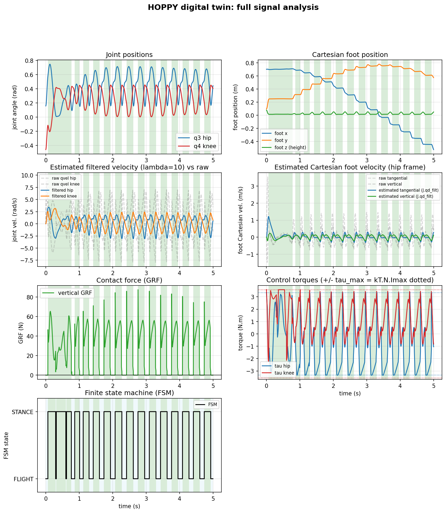

# HOPPY in MuJoCo

Simulation of the HOPPY hopping robot in MuJoCo. Three models share a single
controller, and all of them are checked against the MATLAB reference simulator
in `../Simulator_MATLAB`: a passive gantry plus an active leg, hybrid control at
1 kHz, hard contact and a voltage-based actuator model. The controller is a
faithful port of the MATLAB code, and the abstract model is anchored to
`get_params.m` (masses, inertias, geometry); the boom balance is calibrated so
the gravitational torque matches the MATLAB reference.

## The three models

| Model | File | Geometry | Purpose |
|---|---|---|---|
| Abstract | `tune_eval.py` | simplified, anchored to `get_params.m` | reproduce the paper's MATLAB hop and validate against it |
| CAD twin | `twin.py` | dimensions, masses and inertias measured from the CAD | structural fidelity to the redesign |
| Real URDF | `hoppy_urdf.py` | exported from SolidWorks (sw2urdf) | the model that runs the robot's controller |

All three use `controller.py`. The abstract model uses MuJoCo-specific gains
chosen to match the MATLAB reference hop. The twin and the URDF run the paper's
own constants, the same ones on the physical robot (listed in the top-level
README).

## The shared controller (`controller.py`)

`Hoppy` is the hybrid controller, ported from the MATLAB simulator:

- a FLIGHT/STANCE state machine at 1 kHz;
- a Cartesian foot PD in the hip frame, applied through the transposed Jacobian;
- a Bezier reaction-force profile in stance (vertical force for the hop,
  tangential force for travel around the post);
- a voltage-based actuator model with back-EMF and 12 V / 9.2 A saturation, so
  the torque limit depends on speed;
- a velocity estimate from a filtered derivative of the (quantized) position,
  which emulates the encoder the firmware reads.

## Files

- `tune_eval.py`, `twin.py`, `hoppy_urdf.py`: the three models (each builds its
  MJCF and its parameter set).
- `controller.py`: the shared hybrid controller (`Hoppy`).
- `control.py`: final run of the abstract model, metrics and `figures/results.png`.
- `verify.py`: the verification suite, 12 pass/fail checks plus a comparison
  against the MATLAB reference.
- `twin_check.py`: component-by-component check of the twin.
- `plot_signals.py`: full signal analysis of the twin (`figures/signals.png`).
- `ablation.py`: mechanical-model ablation (`figures/ablation.png`).
- `integrators.py`: implicitfast vs RK4 (`figures/integrators.png`).
- `counterweight.py`: counterweight (float-point balance).
- `render_*.py`, `view_*.py`: offscreen renders/videos and the interactive viewer.

## Usage

```bash
pip install mujoco numpy scipy matplotlib imageio imageio-ffmpeg

python3 control.py                       # abstract model run + figures/results.png
python3 verify.py                        # verification suite (pass/fail + vs MATLAB)
python3 plot_signals.py                  # twin signals -> figures/signals.png
python3 ablation.py                      # ablation -> figures/ablation.png
python3 integrators.py      # integrators -> figures/integrators.png
MUJOCO_GL=egl python3 render_twin.py     # video figures/twin_salto.mp4
python3 view_hop_urdf.py --viewer        # interactive viewer (real URDF)

# MATLAB reference: cd ../Simulator_MATLAB && matlab -batch "export_ref"
```

## Validation

The robot hops, stays stable and travels around the post. `verify.py` checks
this rather than counting foot lift-offs alone: a stance phase that actually
loads (around 27 N) and pushes, a real flight phase, the body rising from the
push (not from floating), the leg staying bent within the reference range, no
flutter (the foot clears more than the body rises), the gantry not collapsing, a
stable limit cycle, travel around the post, and the electrical limits respected.

### Twin signals

`plot_signals.py` records every signal family from a twin run: joint and
Cartesian positions, raw versus filtered velocities, the contact force, the
control torques against their physical limits, and the state machine.



### Abstract model against MATLAB

| Metric | MuJoCo | MATLAB |
|---|---|---|
| Min hip height (m) | 0.115 | 0.115 |
| Max hip height (m) | 0.187 | 0.187 |
| Hop amplitude (cm) | 7.2 | 7.2 |
| Frequency (Hz) | 2.5 | 2.2 |
| Stance fraction (%) | 52 | 60 |
| Leg q4 min (rad) | -2.32 | -2.27 |
| Travel around the post | yes (~1.2 turns over the 8 s run) | yes |
| Peak GRF (N) | 84 | 30 |

Same gait (compress, push, fly, land), the same hip amplitude and range
(0.115 to 0.187 m), the leg bent the same way, and travel around the post like
the reference. The remaining differences are minor: frequency about 14 percent
higher (2.5 vs 2.2 Hz) and a slightly smaller stance fraction. The higher peak
GRF is the measured contact impact in MuJoCo's hard contact, not the desired
Bezier force (whose peak is 42.8 N). The abstract-model gains were found by
search over `verify` plus distance to the reference.
